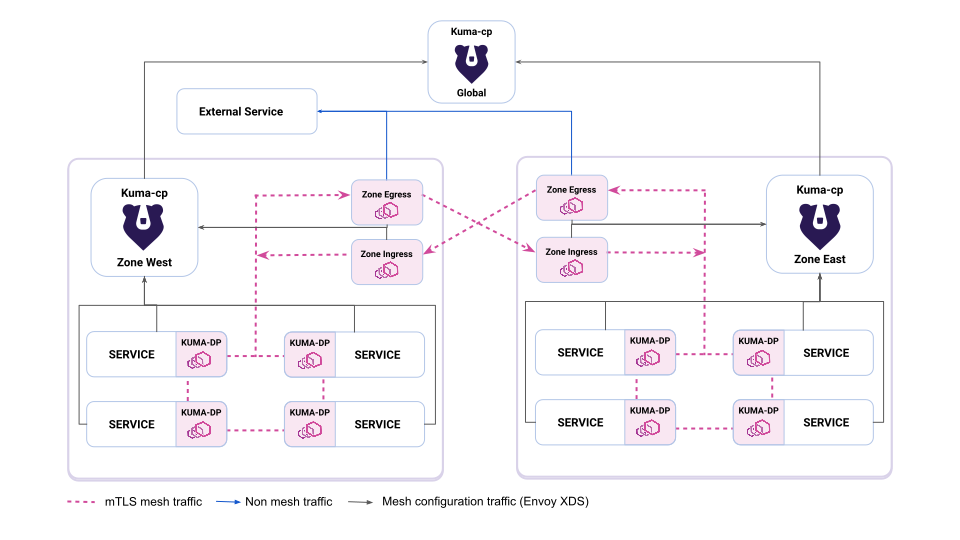
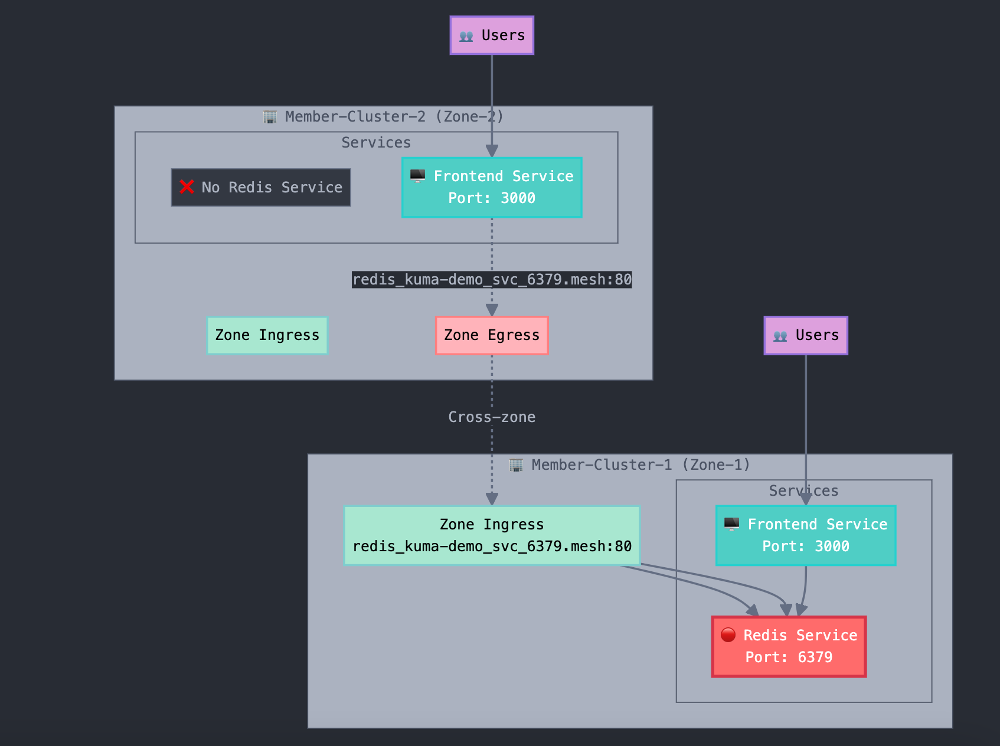

# Multi-Cluster K8s Setup with K3d, Kuma Service Mesh, and Karmada

This guide walks you through setting up a multi-cluster Kubernetes environment locally using K3d, implementing cross-cluster pod communication with Kuma, and using Karmada for unified multi-cluster deployments.

## Official Docs
### Deployment Architecture (WITH ZONE-EGRESS)


### Official Setup Instructions
- https://kuma.io/docs/2.10.x/production/deployment/multi-zone/
- https://kuma.io/docs/2.10.x/production/cp-deployment/multi-zone/


## Prerequisites

```bash
# Install required tools
# K3d
curl -s https://raw.githubusercontent.com/k3d-io/k3d/main/install.sh | bash

# kubectl
curl -LO "https://dl.k8s.io/release/$(curl -L -s https://dl.k8s.io/release/stable.txt)/bin/linux/amd64/kubectl"
chmod +x kubectl && sudo mv kubectl /usr/local/bin/

# Helm
curl https://raw.githubusercontent.com/helm/helm/main/scripts/get-helm-3 | bash

# Kumactl
curl -L https://kuma.io/installer.sh | VERSION=2.10.1 sh -
sudo mv kuma-*/bin/kumactl /usr/local/bin/
```

## Step 1: Create Multi-Cluster K3d Setup

### Create Shared Docker Network and Clusters

```bash
# Create a shared Docker network for all clusters
docker network create k3d-multi-cluster --driver bridge --subnet=172.20.0.0/16 --gateway=172.20.0.1
```

### Create Three Clusters

```bash
# Create cluster 1 (control plane)
k3d cluster create control-plane \
  --api-port 6443 \
  --port "9000:80@loadbalancer" \
  --port "9443:443@loadbalancer" \
  --agents 1 \
  --network k3d-multi-cluster 

# Create cluster 2 (member cluster)
k3d cluster create member-1 \
  --api-port 6444 \
  --port "9001:80@loadbalancer" \
  --port "9444:443@loadbalancer" \
  --agents 1 \
  --network k3d-multi-cluster 

# Create cluster 3 (member cluster)
k3d cluster create member-2 \
  --api-port 6445 \
  --port "9002:80@loadbalancer" \
  --port "9445:443@loadbalancer" \
  --agents 1 \
  --network k3d-multi-cluster 
```

### Verify Clusters

```bash
# List all clusters
k3d cluster list

# Get cluster contexts
kubectl config get-contexts

# Test connectivity to each cluster
kubectl --context k3d-control-plane get nodes
kubectl --context k3d-member-1 get nodes
kubectl --context k3d-member-2 get nodes
```

### Network and Inter-Cluster communication Verification
Test connectivity from Member Clusters to the Control-Plane Cluster

```bash
./scripts/test-clusters-inter-connectivity.sh
```

## Step 2: Install and Configure Kuma for Cross-Cluster Communication

### Install Kuma Control Plane on Global Zone

```bash
# Install Kuma on control-plane cluster (Global zone)
kubectl config use-context k3d-control-plane

# Add Kuma Helm repository
helm repo add kuma https://kumahq.github.io/charts
helm repo update

# Install Kuma in global mode
helm install --create-namespace --namespace kuma-system kuma kuma/kuma \
  --set controlPlane.mode=global

# Wait for Kuma to be ready
kubectl wait --for=condition=Ready pod -l app=kuma-control-plane -n kuma-system --timeout=300s


# Kuma GUI
kubectl port-forward svc/kuma-control-plane -n kuma-system 5681:5681

http://localhost:5681/gui
```

### Get Proper Global ControlPlane (CP) Address (Before Installing Kuma on Member Clusters)
```bash
# Get the actual container IP of the control plane cluster
CONTROL_PLANE_IP=$(docker inspect k3d-control-plane-server-0 --format='{{range .NetworkSettings.Networks}}{{.IPAddress}}{{end}}')
echo "Control Plane IP: $CONTROL_PLANE_IP"

# Set the global CP address for Kuma zone installations
GLOBAL_CP_ADDRESS="grpcs://${CONTROL_PLANE_IP}:5685"
echo "Use this address for GLOBAL_CP_ADDRESS: $GLOBAL_CP_ADDRESS"
```

### Install Kuma on Remote Zones (Member Clusters)

```bash
# Install Kuma on member-1 cluster
kubectl config use-context k3d-member-1
helm upgrade --install --create-namespace --namespace kuma-system kuma kuma/kuma \
  --set controlPlane.mode=zone \
  --set controlPlane.zone=zone-1 \
  --set controlPlane.kdsGlobalAddress=$GLOBAL_CP_ADDRESS \
  --set ingress.enabled=true \
  --set egress.enabled=true \
  --set controlPlane.tls.kdsZoneClient.skipVerify=true


# Install Kuma on member-2 cluster  
kubectl config use-context k3d-member-2
helm upgrade --install --create-namespace --namespace kuma-system kuma kuma/kuma \
  --set controlPlane.mode=zone \
  --set controlPlane.zone=zone-2 \
  --set controlPlane.kdsGlobalAddress=$GLOBAL_CP_ADDRESS \
  --set ingress.enabled=true \
  --set egress.enabled=true \
  --set controlPlane.tls.kdsZoneClient.skipVerify=true

# Wait for member-zone control planes to be ready
kubectl --context k3d-member-1 wait --for=condition=Ready pod -l app=kuma-control-plane -n kuma-system --timeout=300s
kubectl --context k3d-member-2 wait --for=condition=Ready pod -l app=kuma-control-plane -n kuma-system --timeout=300s
```

### Verify Multi-Zone Setup

```bash
# Switch back to global control plane
kubectl config use-context k3d-control-plane

# Create port-forward to kuma-global-control-plane
kubectl port-forward svc/kuma-control-plane -n kuma-system 5681:5681

# Check zone status
kumactl get zones

# Verify zone ingresses
kumactl get zone-ingresses

# Verify zone egresses
kumactl get zoneegresses

# [OPTIONAL] Verify From Kuma GUI
http://localhost:5681/gui
```

### Configure Cross-Zone Communication

```bash
# Switch back to global control plane
kubectl config use-context k3d-control-plane

# Create a mTLS mesh for zero-trust multi-zone communication
kubectl apply -f manifests/mesh/01-mTLS-mesh.yaml

# Kuma does not define default traffic permissions, which means that no traffic will flow with mTLS enabled until we define a proper MeshTrafficPermission policy. The below defines a SAMPLE policy
kubectl apply -f manifests/mesh/02-mesh-traffic-permissions.yaml

```

Read more about how Mesh-Traffic-Permissions work in [kuma_traffic_permission_guide](docs/kuma_traffic_permission_guide.md)


## Step 3: Deploy Cross-Zone kuma-counter-demo App



For detailed architecture information of the demo app, see [Architecture Overview](docs/kuma_demo_app_architecture.md)

### Deploy and verify the demo app
```bash
./scripts/deploy-and-verify-demo-app.sh
```

### Access and test the demo app from browser

#### From Zone-1
```
>> kubectl --context k3d-member-1 port-forward svc/demo-app -n kuma-demo 5000:5000

http://localhost:5000
```

#### From Zone-2
```
>> kubectl --context k3d-member-2 port-forward svc/demo-app -n kuma-demo 5000:5000

http://localhost:5000
```

### Test cross-zone loadbalancing
```
./scripts/test-demo-app-crosszone-connectivity.sh
```

# = TODO =
## Step 4: Install and Configure Karmada

### Install Karmada Control Plane

```bash
# Switch to control-plane cluster
kubectl config use-context k3d-control-plane

# Add Karmada Helm repository
helm repo add karmada https://raw.githubusercontent.com/karmada-io/karmada/master/charts
helm repo update

# Install Karmada
kubectl create namespace karmada-system
helm install karmada karmada/karmada \
  --namespace karmada-system \
  --create-namespace \
  --set apiServer.hostNetwork=false \
  --set apiServer.serviceType=NodePort \
  --set etcd.mode=external \
  --set etcd.external.servers="etcd.karmada-system:2379"

# Wait for Karmada to be ready
kubectl wait --for=condition=Ready pod -l app=karmada-apiserver -n karmada-system --timeout=300s
```

### Install Karmada kubectl Plugin

```bash
# Download karmadactl
curl -s https://raw.githubusercontent.com/karmada-io/karmada/master/hack/install-cli.sh | sudo bash

# Verify installation
kubectl karmada version
```

### Join Member Clusters to Karmada

```bash
# Get Karmada API server endpoint
KARMADA_APISERVER=$(kubectl get svc karmada-apiserver -n karmada-system -o jsonpath='{.spec.clusterIP}'):5443

# Join member clusters
kubectl karmada join member-1 \
  --cluster-kubeconfig=$HOME/.kube/config \
  --cluster-context=k3d-member-1 \
  --karmada-context=k3d-control-plane

kubectl karmada join member-2 \
  --cluster-kubeconfig=$HOME/.kube/config \
  --cluster-context=k3d-member-2 \
  --karmada-context=k3d-control-plane

# Verify cluster registration
kubectl --context k3d-control-plane get clusters
```

## Step 4: Test Cross-Cluster Communication

### Create Test Applications with Kuma Sidecar Injection

```bash
# Create test namespace and enable Kuma sidecar injection
for CLUSTER in k3d-control-plane k3d-member-1 k3d-member-2; do
  kubectl --context $CLUSTER create namespace test-app
  kubectl --context $CLUSTER label namespace test-app kuma.io/sidecar-injection=enabled
done
```

### Deploy Test Service on Control Plane (Global Zone)

```bash
kubectl --context k3d-control-plane apply -f - <<EOF
apiVersion: apps/v1
kind: Deployment
metadata:
  name: hello-service
  namespace: test-app
spec:
  replicas: 2
  selector:
    matchLabels:
      app: hello-service
  template:
    metadata:
      labels:
        app: hello-service
    spec:
      containers:
      - name: hello
        image: nginx:alpine
        ports:
        - containerPort: 80
        command: ["/bin/sh"]
        args: ["-c", "echo 'Hello from Global Zone!' > /usr/share/nginx/html/index.html && nginx -g 'daemon off;'"]
---
apiVersion: v1
kind: Service
metadata:
  name: hello-service
  namespace: test-app
spec:
  selector:
    app: hello-service
  ports:
  - port: 80
    targetPort: 80
EOF
```

### Deploy Test Services on Member Clusters

```bash
# Deploy service on member-1 (zone-1)
kubectl --context k3d-member-1 apply -f - <<EOF
apiVersion: apps/v1
kind: Deployment
metadata:
  name: hello-zone1
  namespace: test-app
spec:
  replicas: 2
  selector:
    matchLabels:
      app: hello-zone1
  template:
    metadata:
      labels:
        app: hello-zone1
    spec:
      containers:
      - name: hello
        image: nginx:alpine
        ports:
        - containerPort: 80
        command: ["/bin/sh"]
        args: ["-c", "echo 'Hello from Zone-1!' > /usr/share/nginx/html/index.html && nginx -g 'daemon off;'"]
---
apiVersion: v1
kind: Service
metadata:
  name: hello-zone1
  namespace: test-app
spec:
  selector:
    app: hello-zone1
  ports:
  - port: 80
    targetPort: 80
EOF

# Deploy service on member-2 (zone-2)
kubectl --context k3d-member-2 apply -f - <<EOF
apiVersion: apps/v1
kind: Deployment
metadata:
  name: hello-zone2
  namespace: test-app
spec:
  replicas: 2
  selector:
    matchLabels:
      app: hello-zone2
  template:
    metadata:
      labels:
        app: hello-zone2
    spec:
      containers:
      - name: hello
        image: nginx:alpine
        ports:
        - containerPort: 80
        command: ["/bin/sh"]
        args: ["-c", "echo 'Hello from Zone-2!' > /usr/share/nginx/html/index.html && nginx -g 'daemon off;'"]
---
apiVersion: v1
kind: Service
metadata:
  name: hello-zone2
  namespace: test-app
spec:
  selector:
    app: hello-zone2
  ports:
  - port: 80
    targetPort: 80
EOF
```

### Deploy Client Application for Testing

```bash
# Deploy client on member-1 to test cross-zone communication
kubectl --context k3d-member-1 apply -f - <<EOF
apiVersion: apps/v1
kind: Deployment
metadata:
  name: client
  namespace: test-app
spec:
  replicas: 1
  selector:
    matchLabels:
      app: client
  template:
    metadata:
      labels:
        app: client
    spec:
      containers:
      - name: client
        image: curlimages/curl:latest
        command: ["sleep", "3600"]
EOF
```

### Test Cross-Zone Communication

```bash
# Wait for sidecars to be injected
kubectl --context k3d-member-1 wait --for=condition=Ready pod -l app=client -n test-app --timeout=120s

# Test communication to service in same zone
kubectl --context k3d-member-1 exec -n test-app deployment/client -- curl -s hello-zone1.test-app.svc.cluster.local

# Test communication to service in different zone (zone-2)
kubectl --context k3d-member-1 exec -n test-app deployment/client -- curl -s hello-zone2.test-app.svc.cluster.local

# Test communication to service in global zone
kubectl --context k3d-member-1 exec -n test-app deployment/client -- curl -s hello-service.test-app.svc.cluster.local
```

## Step 5: Use Karmada for Multi-Cluster Deployments

### Create Karmada Deployment Policy

```bash
kubectl --context k3d-control-plane apply -f - <<EOF
apiVersion: policy.karmada.io/v1alpha1
kind: PropagationPolicy
metadata:
  name: multi-cluster-app-policy
spec:
  resourceSelectors:
    - apiVersion: apps/v1
      kind: Deployment
      name: multi-cluster-app
  placement:
    clusterAffinity:
      clusterNames:
        - member-1
        - member-2
    replicaScheduling:
      replicaDivisionPreference: Weighted
      replicaSchedulingType: Divided
      weightPreference:
        staticWeightList:
          - targetCluster:
              clusterNames:
                - member-1
            weight: 1
          - targetCluster:
              clusterNames:
                - member-2
            weight: 1
EOF
```

### Deploy Multi-Cluster Application

```bash
kubectl --context k3d-control-plane apply -f - <<EOF
apiVersion: apps/v1
kind: Deployment
metadata:
  name: multi-cluster-app
  namespace: default
spec:
  replicas: 4
  selector:
    matchLabels:
      app: multi-cluster-app
  template:
    metadata:
      labels:
        app: multi-cluster-app
    spec:
      containers:
      - name: app
        image: nginx:alpine
        ports:
        - containerPort: 80
---
apiVersion: v1
kind: Service
metadata:
  name: multi-cluster-app-service
  namespace: default
spec:
  selector:
    app: multi-cluster-app
  ports:
  - port: 80
    targetPort: 80
EOF
```

### Create Karmada Service Policy

```bash
kubectl --context k3d-control-plane apply -f - <<EOF
apiVersion: policy.karmada.io/v1alpha1
kind: PropagationPolicy
metadata:
  name: multi-cluster-service-policy
spec:
  resourceSelectors:
    - apiVersion: v1
      kind: Service
      name: multi-cluster-app-service
  placement:
    clusterAffinity:
      clusterNames:
        - member-1
        - member-2
EOF
```

## Step 6: Verification and Testing

### Verify Kuma Multi-Zone Setup

```bash
# Check all dataplanes across zones
kumactl get dataplanes

# Check zone status
kumactl get zones

# Check cross-zone service discovery
kumactl get zone-ingresses

# Inspect mesh configuration
kumactl get mesh default -o yaml
```

### Configure Traffic Policies (Optional)

```bash
# Create traffic permission for cross-zone communication
kubectl --context k3d-control-plane apply -f - <<EOF
apiVersion: kuma.io/v1alpha1
kind: TrafficPermission
metadata:
  name: allow-all-test-app
  namespace: kuma-system
spec:
  sources:
    - match:
        kuma.io/service: '*'
  destinations:
    - match:
        kuma.io/service: '*'
EOF

# Create traffic route for load balancing
kubectl --context k3d-control-plane apply -f - <<EOF
apiVersion: kuma.io/v1alpha1
kind: TrafficRoute
metadata:
  name: hello-service-route
  namespace: kuma-system
spec:
  sources:
    - match:
        kuma.io/service: '*'
  destinations:
    - match:
        kuma.io/service: hello-service_test-app_svc_80
  conf:
    - weight: 100
      destination:
        kuma.io/service: hello-service_test-app_svc_80
EOF
```

## Troubleshooting

### Common Issues and Solutions

1. **Cross-cluster communication not working:**
   - Verify zone ingresses are running: `kumactl get zone-ingresses`
   - Check dataplane registration: `kumactl get dataplanes`
   - Ensure mesh mTLS is properly configured
   - Verify kuma-dp sidecar injection in pods

2. **Karmada deployment not distributing:**
   - Check cluster status: `kubectl --context k3d-control-plane get clusters`
   - Verify propagation policy matches resource selectors
   - Check Karmada controller logs

3. **Service mesh connectivity issues:**
   - Verify Kuma sidecars are injected: `kubectl get pods -o jsonpath='{.items[*].spec.containers[*].name}'`
   - Check zone connectivity: `kumactl get zones`
   - Review kuma-dp proxy logs: `kubectl logs [pod-name] -c kuma-sidecar`

### Cleanup

```bash
# Delete Kuma resources and uninstall
helm uninstall kuma --namespace kuma-system --kube-context k3d-control-plane
helm uninstall kuma --namespace kuma-system --kube-context k3d-member-1  
helm uninstall kuma --namespace kuma-system --kube-context k3d-member-2
kubectl --context k3d-control-plane delete propagationpolicy --all
kubectl karmada unjoin member-1 --cluster-context=k3d-member-1
kubectl karmada unjoin member-2 --cluster-context=k3d-member-2

# Delete K3d clusters
k3d cluster delete control-plane member-1 member-2
```

## Next Steps

1. **Advanced Service Mesh Features:**
   - Implement traffic routing and load balancing policies
   - Set up mutual TLS policies between zones
   - Configure fault injection and circuit breakers
   - Set up observability with metrics and tracing

2. **Karmada Advanced Features:**
   - Implement resource binding policies
   - Set up cluster failover scenarios  
   - Configure advanced scheduling policies
   - Test workload migration between clusters

3. **Monitoring and Observability:**
   - Set up Prometheus and Grafana for multi-cluster monitoring
   - Configure Kuma's built-in observability stack
   - Implement distributed tracing across zones
   - Configure alerting for cross-zone issues

This setup provides a solid foundation for testing multi-cluster Kubernetes deployments with Kuma's lightweight service mesh and unified management through Karmada. Kuma's simpler architecture makes it easier to understand and debug compared to Istio, while still providing enterprise-grade service mesh capabilities.